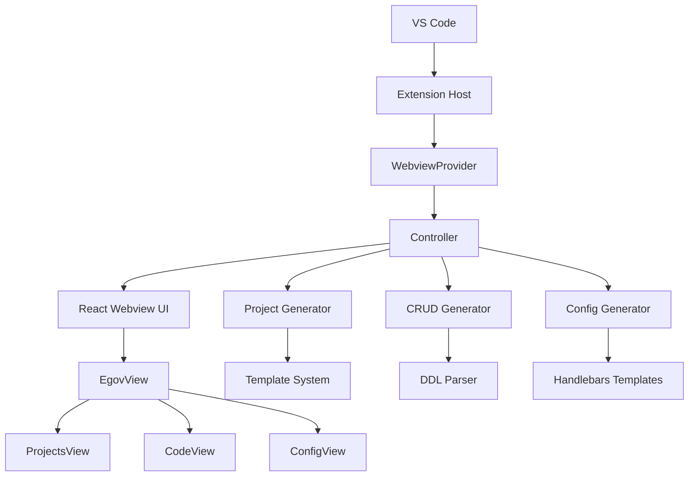

# eGovFrame VSCode Initializr

## 📋 프로젝트 개요

**eGovFrame VSCode Initializr**는 전자정부 표준프레임워크(eGovFrame) 프로젝트 생성 및 설정을 위한 Visual Studio Code 확장 프로그램입니다. 개발자가 eGovFrame 기반 프로젝트를 쉽고 빠르게 시작할 수 있도록 도와주는 통합 도구입니다.

### 주요 기능

- 🚀 **프로젝트 생성**: eGovFrame 템플릿 기반 프로젝트 자동 생성
- ⚙️ **설정 관리**: Spring Framework 설정 파일 (XML, Java Config, YAML, Properties) 생성
- 📝 **코드 생성**: DDL 기반 CRUD 코드 자동 생성
- 👀 **실시간 미리보기**: DDL 변경시 템플릿 미리보기 자동 업데이트 (12개 템플릿 지원)
- ⚡ **성능 최적화**: 병렬 렌더링 및 지연 로딩으로 빠른 응답성
- 🎨 **VSCode 네이티브 UI**: VSCode 테마 통합 커스텀 React 컴포넌트 기반 사용자 인터페이스
- 🌓 **다크/라이트 테마**: VSCode 테마 자동 연동 및 실시간 전환 지원

## 🏗️ 아키텍처 구조

```
┌─────────────────────────────────────────────────────────────┐
│                    VS Code Extension                        │
├─────────────────────────────────────────────────────────────┤
│  Extension Host (Node.js)          │  Webview UI (React)    │
│  ├── extension.ts                  │  ├── App.tsx           │
│  ├── core/                         │  ├── components/       │
│  │   ├── webview/                  │  │   └── egov/         │
│  │   └── controller/               │  ├── context/          │
│  ├── utils/                        │  └── utils/            │
│  │   ├── egovProjectGenerator.ts   │                        │
│  │   ├── crudGenerator.ts          │                        │
│  │   └── configGenerator.ts        │                        │
│  └── services/                     │                        │
└─────────────────────────────────────────────────────────────┘
```

### 컴포넌트 상호작용



## 📁 폴더 구조

### 루트 구조
```
egovframe-vscode-initializr/
├── 📁 assets/              # 아이콘 및 리소스
├── 📁 src/                 # Extension 소스코드
├── 📁 webview-ui/          # React 웹뷰 UI
├── 📁 templates/           # 새로운 템플릿 루트 디렉토리
│   ├── 📁 projects/        # 프로젝트 템플릿
│   │   ├── 📁 examples/    # ZIP 템플릿 파일들 (Git LFS 관리)
│   │   └── 📁 pom/         # Maven POM 템플릿들
│   ├── 📁 config/          # Spring 설정 템플릿
│   └── 📁 code/            # CRUD 코드 템플릿
├── 📄 package.json         # Extension 메니페스트
├── 📄 esbuild.js          # Extension 빌드 설정
├── 📄 .gitattributes      # Git LFS 설정 파일
└── 📄 README.md           # 프로젝트 문서
```

> **💡 Git LFS 관리 파일**: `templates/projects/examples/` 폴더의 ZIP 파일들은 Git LFS로 관리됩니다. 프로젝트 클론 후 `git lfs pull` 명령어로 다운로드하세요.

### Extension 소스 (`src/`)

```
src/
├── 📄 extension.ts                 # Extension 진입점
├── 📁 core/
│   ├── 📁 webview/                # 웹뷰 라이프사이클 관리
│   │   └── 📄 index.ts            # WebviewProvider 클래스
│   └── 📁 controller/             # 웹뷰 메시지 처리 및 작업 관리
│       └── 📄 index.ts            # Controller 클래스
├── 📁 utils/                      # 핵심 생성 유틸리티
│   ├── 📄 egovProjectGenerator.ts # eGovFrame 프로젝트 생성
│   ├── 📄 crudGenerator.ts        # CRUD 코드 생성
│   ├── 📄 configGenerator.ts      # 설정 파일 생성
│   ├── 📄 ddlParser.ts           # DDL 파싱
│   └── 📄 codeGeneratorUtils.ts   # 공통 코드 생성 유틸
├── 📁 services/                   # 보조 서비스
│   └── 📁 glob/
│       └── 📄 list-files.ts       # 파일 목록 서비스
└── 📁 shared/                     # 공유 타입 및 유틸리티
    ├── 📄 api.ts
    ├── 📄 ExtensionMessage.ts
    └── 📄 WebviewMessage.ts
```

### Templates 디렉토리 (`templates/`)

```
templates/
├── 📄 templates-projects.json      # 프로젝트 템플릿 메타데이터
├── 📄 templates-context-xml.json   # 설정 템플릿 메타데이터
├── 📁 projects/                    # 프로젝트 템플릿
│   ├── 📁 examples/                # ZIP 템플릿 파일들
│   │   ├── 📦 egovframe-template-simple-backend.zip
│   │   ├── 📦 egovframe-template-simple-react.zip
│   │   ├── 📦 egovframework-all-in-one-mobile-4.3.0.zip
│   │   ├── 📦 egovframe-msa-portal-backend.zip
│   │   ├── 📦 example-boot-web.zip
│   │   └── 📦 ... (총 22개 템플릿)
│   └── 📁 pom/                     # Maven POM 템플릿들
│       ├── 📄 simple-pom.xml
│       ├── 📄 boot-pom.xml
│       └── 📄 ... (총 15개 POM 템플릿)
├── 📁 config/                      # Spring 설정 템플릿
│   ├── 📁 datasource/              # 데이터소스 설정
│   │   ├── 📄 datasource.hbs
│   │   ├── 📄 datasource-java.hbs
│   │   ├── 📄 jndiDatasource.hbs
│   │   └── 📄 jndiDatasource-java.hbs
│   ├── 📁 cache/                   # 캐시 설정
│   │   ├── 📄 cache.hbs
│   │   ├── 📄 cache-java.hbs
│   │   ├── 📄 ehcacheConfigForSpring.hbs
│   │   └── 📄 ehcacheConfigForSpring-java.hbs
│   ├── 📁 logging/                 # 로깅 설정 (21개 템플릿)
│   │   ├── 📄 console.hbs
│   │   ├── 📄 console-java.hbs
│   │   ├── 📄 console-yaml.hbs
│   │   ├── 📄 console-properties.hbs
│   │   ├── 📄 file.hbs
│   │   ├── 📄 rollingFile.hbs
│   │   └── 📄 ... (다양한 로깅 appender 템플릿)
│   ├── 📁 scheduling/              # 스케줄링 설정 (10개 템플릿)
│   │   ├── 📄 scheduler.hbs
│   │   ├── 📄 beanJob.hbs
│   │   ├── 📄 cronTrigger.hbs
│   │   └── 📄 simpleTrigger.hbs
│   ├── 📁 transaction/             # 트랜잭션 설정 (6개 템플릿)
│   │   ├── 📄 datasource.hbs
│   │   ├── 📄 jpa.hbs
│   │   └── 📄 jta.hbs
│   ├── 📁 idGeneration/            # ID 생성 설정 (6개 템플릿)
│   │   ├── 📄 xml-id-gnr-sequence-service.hbs
│   │   ├── 📄 xml-id-gnr-table-service.hbs
│   │   └── 📄 xml-id-gnr-uuid-service.hbs
│   └── 📁 property/                # 프로퍼티 설정 (2개 템플릿)
│       ├── 📄 property.hbs
│       └── 📄 property-java.hbs
└── 📁 code/                        # CRUD 코드 템플릿
    ├── 📄 sample-controller-template.hbs
    ├── 📄 sample-service-template.hbs
    ├── 📄 sample-service-impl-template.hbs
    ├── 📄 sample-dao-template.hbs
    ├── 📄 sample-vo-template.hbs
    ├── 📄 sample-mapper-template.hbs
    ├── 📄 sample-mapper-interface-template.hbs
    ├── 📄 sample-jsp-list.hbs
    ├── 📄 sample-jsp-register.hbs
    ├── 📄 sample-thymeleaf-list.hbs
    ├── 📄 sample-thymeleaf-register.hbs
    └── 📄 sample-default-vo-template.hbs
```

### Webview UI (`webview-ui/`)

```
webview-ui/
├── 📄 package.json             # React 앱 의존성
├── 📄 vite.config.ts           # Vite 빌드 설정
├── 📄 tailwind.config.js       # TailwindCSS 설정 (VSCode 테마 통합)
└── 📁 src/
    ├── 📄 App.tsx              # 메인 React 앱
    ├── 📄 main.tsx             # React 진입점
    ├── 📁 components/
    │   ├── 📁 ui/                      # 커스텀 UI 컴포넌트 라이브러리
    │   │   ├── 📄 Button.tsx           # VSCode 스타일 버튼
    │   │   ├── 📄 TextField.tsx        # VSCode 스타일 입력 필드
    │   │   ├── 📄 TextArea.tsx         # VSCode 스타일 텍스트 영역
    │   │   ├── 📄 Select.tsx           # VSCode 스타일 드롭다운
    │   │   ├── 📄 RadioGroup.tsx       # VSCode 스타일 라디오 그룹
    │   │   ├── 📄 Checkbox.tsx         # VSCode 스타일 체크박스
    │   │   ├── 📄 ProgressRing.tsx     # VSCode 스타일 프로그레스
    │   │   ├── 📄 Link.tsx             # VSCode 스타일 링크
    │   │   ├── 📄 Divider.tsx          # VSCode 스타일 구분선
    │   │   ├── 📄 index.ts             # 컴포넌트 라이브러리 엔트리포인트
    │   │   └── 📄 VSCodeThemeProvider.tsx # VSCode 테마 컨텍스트
    │   └── 📁 egov/
    │       ├── 📄 EgovView.tsx         # 메인 탭 인터페이스
    │       ├── 📁 tabs/
    │       │   ├── 📄 ProjectsView.tsx  # 프로젝트 생성 탭
    │       │   ├── 📄 CodeView.tsx      # 코드 생성 탭 (네이티브 textarea)
    │       │   └── 📄 ConfigView.tsx    # 설정 생성 탭 (네이티브 select)
    │       ├── 📁 forms/               # 다양한 설정 폼들 (커스텀 컴포넌트 사용)
    │       │   ├── 📄 DatasourceForm.tsx
    │       │   ├── 📄 CacheForm.tsx
    │       │   ├── 📄 LoggingForm.tsx
    │       │   ├── 📄 TransactionForm.tsx
    │       │   ├── 📄 SchedulingForm.tsx
    │       │   └── 📄 ...
    │       └── 📁 templates/           # Handlebars 템플릿
    │           ├── 📄 templates-context-xml.json
    │           └── 📁 config/
    │               ├── 📁 datasource/
    │               ├── 📁 cache/
    │               ├── 📁 logging/
    │               ├── 📁 scheduling/
    │               └── 📁 ...
    ├── 📁 context/
    │   └── 📄 ExtensionStateContext.tsx
    └── 📁 utils/
        ├── 📄 templateUtils.ts
        ├── 📄 ddlParser.ts
        ├── 📄 cn.ts                    # 클래스 네임 유틸리티
        └── 📄 egovUtils.ts
```

## 🎨 UI 컴포넌트 시스템

### VSCode 테마 통합 아키텍처

프로젝트는 VSCode의 네이티브 디자인 시스템과 완전히 통합된 커스텀 React 컴포넌트 라이브러리를 구축했습니다.

#### 핵심 설계 원칙
- **네이티브 VSCode 스타일**: 모든 UI 컴포넌트가 VSCode 기본 테마와 일관성 유지
- **다크/라이트 테마 지원**: VSCode CSS 변수를 활용한 자동 테마 전환
- **접근성 우선**: WCAG 2.1 가이드라인 준수
- **타입 안전성**: 완전한 TypeScript 지원

#### 커스텀 UI 컴포넌트 라이브러리

| 컴포넌트 | 설명 | VSCode 테마 변수 |
|----------|------|------------------|
| **Button** | Primary, Secondary, Ghost 버튼 | `--vscode-button-*` |
| **TextField** | 텍스트 입력 필드 | `--vscode-input-*` |
| **TextArea** | 멀티라인 텍스트 입력 | `--vscode-input-*` |
| **Select** | 드롭다운 선택 박스 | `--vscode-input-*` |
| **RadioGroup** | 라디오 버튼 그룹 | `--vscode-checkbox-*` |
| **Checkbox** | 체크박스 입력 | `--vscode-checkbox-*` |
| **ProgressRing** | 로딩 인디케이터 | `--vscode-progressBar-*` |
| **Link** | 링크 컴포넌트 | `--vscode-textLink-*` |
| **Divider** | 구분선 | `--vscode-panel-border` |

#### VSCode 테마 변수 활용
```typescript
// 예시: Button 컴포넌트의 테마 스타일
const getButtonStyles = (variant: 'primary' | 'secondary') => ({
  backgroundColor: variant === 'primary'
    ? 'var(--vscode-button-background)'
    : 'var(--vscode-button-secondaryBackground)',
  color: variant === 'primary'
    ? 'var(--vscode-button-foreground)'
    : 'var(--vscode-button-secondaryForeground)',
  border: '1px solid var(--vscode-button-border)',
  // 호버 효과
  '&:hover': {
    backgroundColor: variant === 'primary'
      ? 'var(--vscode-button-hoverBackground)'
      : 'var(--vscode-button-secondaryHoverBackground)'
  }
})
```

#### 네이티브 HTML 엘리먼트 활용
성능 최적화와 브라우저 호환성을 위해 핵심 입력 컴포넌트들은 네이티브 HTML 엘리먼트를 직접 사용:

- **CodeView DDL TextArea**: `<textarea>` + VSCode 테마 인라인 스타일
- **Select 박스들**: `<select>` + `appearance: none` + VSCode 테마 스타일
- **모든 버튼들**: `<button>` + 동적 이벤트 핸들러

#### 테마 시스템 구조
```typescript
// VSCode 테마 컨텍스트
interface VSCodeTheme {
  colors: {
    // 배경색
    background: string
    inputBackground: string
    buttonBackground: string

    // 전경색
    foreground: string
    inputForeground: string
    buttonForeground: string

    // 테두리
    inputBorder: string
    focusBorder: string
  }
  spacing: { xs: string, sm: string, md: string, lg: string }
  borderRadius: { sm: string, md: string, lg: string }
  fontSize: { xs: string, sm: string, md: string, lg: string }
}
```

## 🚀 주요 기능별 상세 설명

### 1. 프로젝트 생성 (Projects)

#### 기능 개요
- eGovFrame 표준 템플릿 기반 프로젝트 자동 생성
- Maven/Gradle 프로젝트 구조 지원
- 다양한 카테고리별 템플릿 제공

### 2. 코드 생성 (CodeView)

#### 기능 개요
- DDL 기반 CRUD 코드 자동 생성
- 12개 템플릿 타입 지원 (VO, Service, Controller, DAO, Mapper, JSP, Thymeleaf 등)
- 실시간 DDL 검증 및 파싱

#### 🆕 미리보기 기능
**새로 추가된 핵심 기능으로, 생성될 코드를 미리 확인할 수 있습니다.**

##### 주요 특징
- **12개 템플릿 미리보기**: VO, DefaultVO, Controller, Service, ServiceImpl, Mapper, MapperInterface, DAO, JSP List/Register, Thymeleaf List/Register
- **실시간 업데이트**: DDL 변경시 자동으로 미리보기 무효화
- **선택적 자동 업데이트**: 사용자가 원할 때만 자동 미리보기 생성
- **병렬 렌더링**: 12개 템플릿을 동시에 처리하여 빠른 미리보기 생성
- **Handlebars 바인딩**: 실제 데이터가 바인딩된 완성된 코드 미리보기

##### 사용 방법
1. **DDL 입력**: MySQL/PostgreSQL DDL 문법으로 테이블 정의
2. **빠른 검증**: 300ms 내 DDL 유효성 검사 완료
3. **미리보기 생성**: "미리보기 생성" 버튼 클릭
4. **템플릿 선택**: 드롭다운에서 원하는 템플릿 선택
5. **코드 확인**: 실제 바인딩된 코드 미리보기
6. **자동 업데이트**: 체크박스로 DDL 변경시 자동 미리보기 업데이트 설정

##### 성능 최적화
- **지연 로딩**: 필요시에만 미리보기 생성 (기본 동작)
- **병렬 처리**: Promise.all()을 사용한 12개 템플릿 동시 렌더링
- **디바운싱**: 300ms 디바운스로 불필요한 요청 방지
- **캐시 무효화**: DDL 변경시 기존 미리보기 자동 초기화

##### 지원 템플릿 목록
| 템플릿 | 설명 | 파일 확장자 |
|--------|------|-------------|
| **VO** | Value Object 클래스 | `.java` |
| **DefaultVO** | 기본 VO 클래스 | `.java` |
| **Controller** | Spring MVC 컨트롤러 | `.java` |
| **Service** | 서비스 인터페이스 | `.java` |
| **ServiceImpl** | 서비스 구현체 | `.java` |
| **Mapper** | MyBatis XML 매퍼 | `.xml` |
| **MapperInterface** | MyBatis 인터페이스 | `.java` |
| **DAO** | Data Access Object | `.java` |
| **JSP List** | 목록 페이지 | `.jsp` |
| **JSP Register** | 등록/수정 페이지 | `.jsp` |
| **Thymeleaf List** | 목록 페이지 | `.html` |
| **Thymeleaf Register** | 등록/수정 페이지 | `.html` |

## 🔧 빌드 시스템

### Extension 빌드 (ESBuild)

**설정 파일**: `esbuild.js`

#### 주요 특징
- **번들링**: 모든 소스를 단일 `dist/extension.js` 파일로 번들
- **타입스크립트 컴파일**: 네이티브 TS 지원
- **경로 별칭**: `@core`, `@utils`, `@shared` 등 단축 경로
- **감시 모드**: 개발 중 자동 리빌드
- **WASM 파일 복사**: Tree-sitter 언어 파서용

#### 빌드 명령어
```bash
# 개발 빌드 + 감시
npm run watch

# 프로덕션 빌드
npm run package

# 타입 체크
npm run check-types

# 린팅
npm run lint
```

### Webview UI 빌드 (Vite)

**설정 파일**: `webview-ui/vite.config.ts`

#### 주요 특징
- **React + SWC**: 빠른 개발 서버 및 빌드
- **TailwindCSS + VSCode 테마**: 유틸리티 우선 CSS + VSCode 네이티브 스타일
- **커스텀 UI 라이브러리**: VSCode 테마 통합 React 컴포넌트
- **HMR**: Hot Module Replacement로 빠른 개발
- **타입스크립트**: 완전한 타입 안정성 (UI 컴포넌트 포함)
- **테스트**: Vitest + JSdom 환경

#### 빌드 명령어
```bash
# 개발 서버 시작
cd webview-ui && npm run dev

# 프로덕션 빌드
cd webview-ui && npm run build

# 테스트 실행
cd webview-ui && npm run test

# 테스트 커버리지
cd webview-ui && npm run test:coverage
```

## 🚀 사용 예시

### 미리보기 기능 사용하기

#### 1. DDL 입력 및 검증
```sql
CREATE TABLE users (
  id INT PRIMARY KEY AUTO_INCREMENT,
  name VARCHAR(100) NOT NULL,
  email VARCHAR(100) UNIQUE NOT NULL,
  created_at TIMESTAMP DEFAULT CURRENT_TIMESTAMP
);
```

#### 2. 미리보기 생성
1. DDL 입력 후 300ms 내 유효성 검사 완료
2. "미리보기 생성" 버튼 클릭
3. 드롭다운에서 원하는 템플릿 선택 (예: VO, Controller, Service 등)
4. 실제 바인딩된 코드 미리보기 확인

#### 3. 자동 업데이트 설정
- "DDL 변경시 자동으로 미리보기 업데이트" 체크박스 활성화
- DDL 수정시 자동으로 미리보기 업데이트

#### 4. 코드 생성
- 미리보기 확인 후 "Generate Code" 버튼 클릭
- 선택된 출력 경로에 모든 CRUD 파일 생성

## 🔄 개발 워크플로우

### 1. 초기 설정

#### Git LFS 설정 (필수)
이 프로젝트는 큰 템플릿 파일들을 Git LFS(Large File Storage)로 관리합니다. 프로젝트를 클론하기 전에 Git LFS가 설치되어 있는지 확인하세요.

```bash
# Git LFS 설치 (macOS)
brew install git-lfs

# Git LFS 설치 (Ubuntu/Debian)
curl -s https://packagecloud.io/install/repositories/github/git-lfs/script.deb.sh | sudo bash
sudo apt-get install git-lfs

# Git LFS 설치 (Windows)
# https://git-lfs.github.com/ 에서 다운로드

# Git LFS 초기화
git lfs install
```

#### 프로젝트 클론 및 설정
```bash
# 프로젝트 클론
git clone <repository-url>
cd egovframe-vscode-initializr

# Git LFS 파일들 다운로드 (클론 후 필수)
git lfs pull

# 전체 의존성 설치
npm run install:all
```

### 2. Git Hooks 설정 (자동 코드 형식 맞춤)
프로젝트는 커밋하기 전에 자동으로 코드 형식을 맞추는 Git hooks가 설정되어 있습니다.

#### 설정된 기능
- **husky**: Git hooks 관리
- **lint-staged**: 스테이징된 파일들에만 특정 작업 실행
- **pre-commit hook**: 커밋 전 자동 코드 형식 맞춤

#### 작동 방식
`git commit` 실행 시 자동으로:
1. **JavaScript/TypeScript 파일들**: `prettier --write` + `eslint --fix`
2. **JSON, MD, YAML 파일들**: `prettier --write`
3. 수정된 파일들이 자동으로 스테이징되고 커밋됨

#### 사용법
```bash
# 평소처럼 개발 후
git add .
git commit -m "커밋 메시지"
# → 자동으로 코드 형식이 맞춰지고 커밋됨
```

#### 수동 실행
```bash
# 전체 프로젝트 코드 형식 맞춤
npm run format:fix

# 린팅 오류 수정
npm run lint
```

### 3. 개발 모드 실행
```bash
# Terminal 1: Extension 감시 빌드
npm run watch

# Terminal 2: Webview UI 개발 서버
npm run dev:webview
```

### 4. 디버깅 설정
VS Code에서 F5 키를 눌러 Extension Development Host 실행

**`.vscode/launch.json`** 설정이 필요한 경우:
```json
{
    "version": "0.2.0",
    "configurations": [
        {
            "name": "Run Extension",
            "type": "extensionHost",
            "request": "launch",
            "args": ["--extensionDevelopmentPath=${workspaceFolder}"],
            "outFiles": ["${workspaceFolder}/dist/**/*.js"],
            "preLaunchTask": "${workspaceFolder}/npm: compile"
        }
    ]
}
```

### 5. 테스트 실행
```bash
# Extension 테스트 (향후 추가 예정)
npm test

# Webview UI 테스트
cd webview-ui && npm run test
```

### 6. Git LFS 문제 해결

#### 큰 파일 다운로드 실패 시
```bash
# Git LFS 파일들 강제 다운로드
git lfs pull --include="*.zip"

# 특정 파일만 다운로드
git lfs pull --include="templates/projects/examples/*.zip"
```

#### Git LFS 상태 확인
```bash
# LFS로 추적되는 파일 목록 확인
git lfs ls-files

# LFS 설정 확인
git lfs track
```

#### Git LFS 재설정
```bash
# LFS 설정 초기화
git lfs uninstall
git lfs install

# LFS 파일들 다시 다운로드
git lfs pull
```

## 📦 배포 및 퍼블리싱

### 1. Extension 패키징
```bash
# VSIX 파일 생성
npm run package
vsce package

# 생성된 파일: egovframe-initializr-{version}.vsix
```

### 2. 마켓플레이스 배포
```bash
# VS Code 마켓플레이스 배포
vsce publish

# 특정 버전 배포
vsce publish 1.0.1
```

### 3. 배포 전 체크리스트
- [ ] 모든 테스트 통과
- [ ] 린팅 오류 없음
- [ ] `package.json` 버전 업데이트
- [ ] `CHANGELOG.md` 작성
- [ ] 프로덕션 빌드 테스트
- [ ] Extension Host에서 수동 테스트

## 🛠️ 기술 스택

### Backend (Extension Host)
- **런타임**: Node.js
- **언어**: TypeScript
- **빌드**: ESBuild
- **템플릿**: Handlebars
- **파일 처리**: fs-extra
- **압축**: archiver

### Frontend (Webview UI)
- **프레임워크**: React 18
- **언어**: TypeScript
- **빌드**: Vite + SWC
- **스타일링**: TailwindCSS + VSCode 테마 통합
- **UI 컴포넌트**: 커스텀 React 컴포넌트 (VSCode 네이티브 스타일)
- **테마 시스템**: VSCode CSS 변수 기반 다크/라이트 테마 지원
- **상태 관리**: React Context API + 커스텀 훅
- **폼 처리**: 네이티브 HTML 폼 + React 상태 관리
- **테스트**: Vitest + Testing Library

### 개발 도구
- **린터**: ESLint + TypeScript ESLint
- **포매터**: Prettier
- **타입 체킹**: TypeScript

## 🔍 트러블슈팅

### 일반적인 문제들

#### 1. Extension이 활성화되지 않는 경우
```bash
# 빌드 상태 확인
npm run check-types
npm run compile

# VS Code 개발자 도구에서 오류 확인
Ctrl+Shift+I (또는 Cmd+Option+I)
```

#### 2. Webview가 로드되지 않는 경우
```bash
# Webview UI 빌드 확인
cd webview-ui
npm run build

# 개발 서버 포트 확인 (25463)
npm run dev
```

#### 3. 템플릿 생성 오류
- `templates` 폴더의 템플릿 파일 존재 확인
- 출력 경로 권한 확인
- Handlebars 템플릿 문법 오류 검토

#### 4. CRUD 생성 실패
- DDL 문법 확인 (MySQL, PostgreSQL 등)
- 패키지명 유효성 검사
- 출력 폴더 접근 권한 확인

#### 5. 미리보기 기능 문제
- **미리보기가 표시되지 않는 경우**:
  - DDL 유효성 확인 (300ms 내 검증 완료)
  - "미리보기 생성" 버튼 클릭
  - 브라우저 개발자 도구에서 오류 확인
- **미리보기가 업데이트되지 않는 경우**:
  - DDL 변경 후 자동 무효화 확인
  - 자동 업데이트 옵션 활성화 여부 확인
  - 수동으로 "미리보기 생성" 버튼 재클릭
- **미리보기 생성이 느린 경우**:
  - 12개 템플릿 병렬 렌더링 확인
  - 네트워크 상태 및 VSCode 성능 확인

### 로그 확인 방법
```bash
# Extension 로그
VS Code > View > Output > eGovFrame Initializr

# Webview 로그
VS Code > Help > Toggle Developer Tools > Console
```

## 📈 성능 최적화

### Extension 최적화
- **지연 로딩**: `activationEvents`를 `onStartupFinished`로 설정
- **번들 크기**: ESBuild로 최소화된 번들
- **메모리 관리**: Webview 인스턴스 적절한 해제

### Webview UI 최적화
- **코드 분할**: Vite의 동적 import 활용
- **네이티브 HTML 엘리먼트**: 성능 최적화를 위해 textarea, select, button 직접 사용
- **VSCode CSS 변수**: 런타임 테마 전환 최적화
- **리소스 최적화**: 이미지 및 폰트 최적화
- **메모이제이션**: React.memo, useMemo 적극 활용
- **경량 UI 라이브러리**: 외부 UI 라이브러리 제거로 번들 크기 최소화

### 🆕 미리보기 성능 최적화
**새로 추가된 미리보기 기능의 성능 최적화 전략**

#### 병렬 렌더링
- **이전**: 12개 템플릿을 순차적으로 렌더링 (느림)
- **현재**: `Promise.all()`을 사용하여 12개 템플릿을 병렬로 렌더링 (빠름)
- **개선율**: 약 12배 성능 향상

#### 지연 미리보기 (Lazy Preview)
- **이전**: DDL 입력시마다 모든 템플릿 미리보기 생성 (매우 느림)
- **현재**: 
  - DDL 입력시 빠른 검증만 수행 (300ms)
  - 사용자가 "미리보기 생성" 버튼을 클릭할 때만 전체 미리보기 생성
- **개선율**: 불필요한 리소스 사용 방지, 사용자 선택권 제공

#### 스마트 캐시 관리
- **DDL 변경 감지**: DDL이 변경되면 기존 미리보기 자동 무효화
- **선택적 자동 업데이트**: 사용자가 원할 때만 자동 미리보기 업데이트
- **디바운싱**: 300ms 디바운스로 불필요한 요청 방지

#### 성능 개선 효과
| 작업 | 이전 | 현재 | 개선율 |
|------|------|------|--------|
| **DDL 검증** | 500ms+ (미리보기 포함) | 300ms (검증만) | **40%+ 빨라짐** |
| **미리보기 생성** | 매번 자동 생성 | 필요시만 생성 | **필요시에만** |
| **템플릿 렌더링** | 순차 처리 | 병렬 처리 | **12배 빨라짐** |

## 🤝 기여 가이드

### 개발 참여 절차
1. **포크 및 클론**
   ```bash
   # Git LFS 설치 확인
   git lfs version
   
   # 프로젝트 클론
   git clone https://github.com/egovframework/egovframe-vscode-initializr.git
   cd egovframe-vscode-initializr
   
   # Git LFS 파일들 다운로드
   git lfs pull
   ```

2. **브랜치 생성**
   ```bash
   git checkout -b feature/new-feature
   ```

3. **개발 및 테스트**
   ```bash
   npm run install:all
   npm run watch
   npm run dev:webview
   ```

4. **코드 품질 검사**
   ```bash
   npm run lint
   npm run format:fix
   npm run check-types
   ```

5. **풀 리퀘스트 생성**

### 코딩 컨벤션
- **TypeScript**: strict 모드 사용
- **네이밍**: camelCase (변수, 함수), PascalCase (클래스, 인터페이스)
- **파일명**: kebab-case 권장
- **커밋 메시지**: Conventional Commits 규칙 준수

### 새로운 UI 컴포넌트 추가하기

1. **컴포넌트 파일 생성**
   ```tsx
   // webview-ui/src/components/ui/NewComponent.tsx
   import React from 'react'
   import { cn } from '../../utils/cn'
   import { useVSCodeTheme } from './VSCodeThemeProvider'

   export interface NewComponentProps extends React.HTMLAttributes<HTMLDivElement> {
     variant?: 'primary' | 'secondary'
     size?: 'sm' | 'md' | 'lg'
   }

   export const NewComponent: React.FC<NewComponentProps> = ({
     variant = 'primary',
     size = 'md',
     className,
     ...props
   }) => {
     const theme = useVSCodeTheme()

     return (
       <div
         className={cn('custom-component', className)}
         style={{
           backgroundColor: 'var(--vscode-input-background)',
           color: 'var(--vscode-input-foreground)',
           border: '1px solid var(--vscode-input-border)',
           // VSCode 테마 변수 활용
         }}
         {...props}
       />
     )
   }
   ```

2. **컴포넌트 라이브러리 등록**
   ```tsx
   // webview-ui/src/components/ui/index.ts
   export { NewComponent, type NewComponentProps } from './NewComponent'
   ```

3. **네이티브 HTML 엘리먼트 활용 (권장)**
   ```tsx
   // 성능 최적화를 위해 네이티브 엘리먼트 직접 사용
   <input
     style={{
       backgroundColor: 'var(--vscode-input-background)',
       color: 'var(--vscode-input-foreground)',
       border: '1px solid var(--vscode-input-border)',
       appearance: 'none',
       WebkitAppearance: 'none',
       MozAppearance: 'none',
     }}
     onFocus={(e) => {
       (e.target as HTMLInputElement).style.borderColor = 'var(--vscode-focusBorder)'
     }}
   />
   ```

### 새로운 템플릿 추가하기

1. **템플릿 파일 생성**
   ```
   templates/config/{category}/{template}.hbs
   ```

2. **메타데이터 추가**
   ```json
   // templates/templates-context-xml.json
   {
       "displayName": "Category > New Template",
       "templateFolder": "category",
       "templateFile": "template.hbs",
       "webView": "category-template-form.tsx",
       "fileNameProperty": "txtFileName",
       "javaConfigTemplate": "template-java.hbs",
       "yamlTemplate": "template-yaml.hbs",
       "propertiesTemplate": "template-properties.hbs"
   }
   ```

3. **폼 컴포넌트 생성 (커스텀 UI 컴포넌트 사용)**
   ```tsx
   // webview-ui/src/components/egov/forms/CategoryTemplateForm.tsx
   import { Button, TextField, Select, RadioGroup } from "../../ui"

   const CategoryTemplateForm: React.FC<FormProps> = ({ onSubmit }) => {
     return (
       <form onSubmit={onSubmit}>
         <TextField label="Template Name" />
         <Select options={[...]} />
         <RadioGroup options={[...]} />
         <Button variant="primary" type="submit">Generate</Button>
       </form>
     )
   }
   ```

## 📚 참고 자료

### 공식 문서
- [VS Code Extension API](https://code.visualstudio.com/api)
- [eGovFrame 공식 사이트](https://www.egovframe.go.kr)
- [Spring Framework 문서](https://spring.io/docs)

### 기술 문서
- [React 공식 문서](https://react.dev)
- [TypeScript 문서](https://www.typescriptlang.org/docs/)
- [Vite 문서](https://vitejs.dev)
- [TailwindCSS 문서](https://tailwindcss.com)
- [Handlebars 문서](https://handlebarsjs.com)

## 📝 라이선스

이 프로젝트는 Apache-2.0 라이선스 하에 배포됩니다. 자세한 내용은 [LICENSE](LICENSE) 파일을 참조하세요.

## 👥 개발팀

- **eGovFrame Center** - 주관 기관
- **개발자**: [기여자 목록](CONTRIBUTORS.md)

## 📞 지원 및 문의

- **이슈 트래킹**: [GitHub Issues](https://github.com/egovframework/egovframe-vscode-initializr/issues)
- **공식 홈페이지**: https://www.egovframe.go.kr
- **문서**: [Wiki 페이지](https://github.com/egovframework/egovframe-vscode-initializr/wiki)

---

이 README는 프로젝트 인계 및 신규 개발자 온보딩을 위한 종합 가이드입니다. 추가 질문이나 개선사항이 있으시면 이슈를 등록해 주세요.